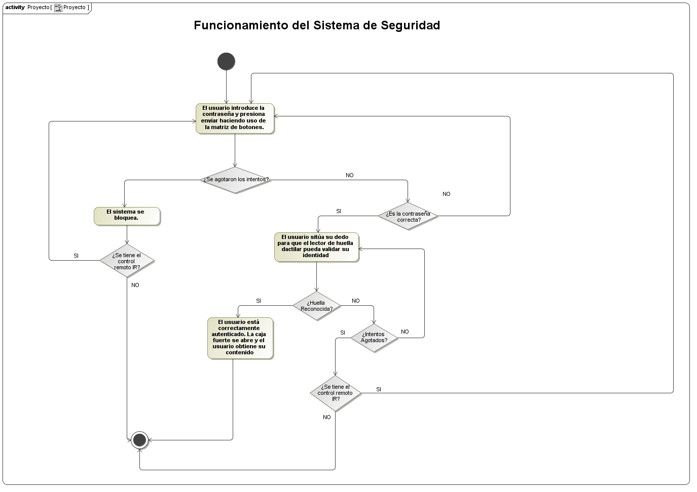
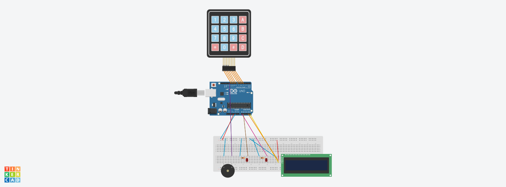

# Grupo 16: TBD

## Tabla de Contenidos
- [Grupo 16: TBD](#grupo-16-tbd)
- [Tabla de Contenidos](#tabla-de-contenidos)
- [Participantes](#-participantes)
- [Librerías Necesarias](#-librerías-necesarias)
- [Introducción](#-introducción)
- [Funcionamiento](#-funcionamiento)
- [Material Usado y Costes](#-material-usado-y-costes)
- [Diseño](#-diseño)
- [Estructura del Proyecto](#-estructura-del-proyecto)
- [Implementación](#-implementación)
- [Construcción](#-construcción)
- [Demostración](#-demostración)

## 👥 Participantes
<table>
  <thead>
    <th>Nombre</th>
    <th>Cuenta de la Universidad</th>
  </thead>
  <tbody>
    <tr>
      <td>Alfonso Rodríguez Gutt</td>
      <td>a.rodriguezgu.2022@alumnos.urjc.es</td>
    </tr>
    <tr>
      <td>Raúl Sánchez Benítez</td>
      <td>TBD</td>
    </tr>
    <tr>
      <td>Héctor González Viñas</td>
      <td>TBD</td>
    </tr>
    <tr>
      <td>Andrés Muñoz Muñoz</td>
      <td>TBD</td>
    </tr>
  </tbody>
</table>

## 📚 Librerías Necesarias
Para el desarrollo de este proyecto, se hicieron uso de algunas librerías externas que es probable que no estén instaladas por defecto en su IDE de Arduino, a continuación se mencionarán dichas librerías:
- Keypad.h
- LiquidCrystal_I2C.h
- IRremote.h
- TaskScheduler.h
- DHT.h
- Adafruit_Fingerprint.h
- Servo.h

## 🚀 Introducción
**BREVE INTRODUCCIÓN DEL PROYECTO**

## 🧠 Funcionamiento
El comportamiento de este sistema es bastante similar al de un sistema de seguridad común que se puede encontrar en el día a día. Para este proyecto, se decidió dividir el sistema en 2 bloques independientes, en uno se iba a encontrar toda la lógica y gestión de la caja fuerte, y en la otra, todo lo relacionado con la cámara y su pequeño sistema de refrigeración.

### 🔒 Bloque 1
Se dispone de una matriz de botones 4x4 en el que el usuario tendrá 3 intentos para introducir la contraseña correcta; en caso de agotar todos los intentos, el sistema se bloqueará, y solo el dueño de la caja fuerte podrá habilitar nuevamente el sistema. En caso contrario, el usuario deberá de validar su huella dactilar haciendo uso del lector de huellas, como último factor de autenticación antes de poder acceder a la caja fuerte; en donde tendrá un total de 5 intentos para colocar la huella correcta, en caso de agotar los intentos, el sistema se bloqueará. Una vez la huella sea reconocida, la caja fuerte se abrirá desplegando consigo un brazo mecánico que tendrá consigo el objeto que se guardó.

### 📷❄️ Bloque 2
Para añadir una mejor seguridad y proporcionar mayor información sobre lo que está sucediendo cuando un usuaro intenta interacturar con el sistema, se utilizó una cámara de seguridad cuyo funcionamiento es indepediente del bloque anterior. Esta cámara transmitirá en vivo y en directo todo lo que suceda mientras un usuario se encuentre interactuando con el sistema. Sin embargo, esta cámara tiene un ligero defecto y es el aumento de temperatura que puede sufrir mientras esté operativa, es por ello, que se decidió controlar dicha temperatura haciendo uso de un sensor de temperatura, que, tras superar una temperatura umbral, activaría un ventilador para enfriar un poco dicha cámara.

### 📡 Desbloqueo del Sistema y Comunicación Serial
Como se explicó previamente, una vez que se agotan todos los intentos disponibles (ya sea para ingresar la contraseña o verificar la huella dactilar), el sistema entra en un estado de bloqueo permanente. Sin embargo, existe un mecanismo especial para que el propietario pueda desbloquearlo: el uso de un control remoto infrarrojo (IR). Al presionar un botón específico en el control, se envía una señal que es captada por un receptor IR, lo cual permite al sistema salir del estado de bloqueo.

Cabe destacar que la comunicación entre los componentes encargados de este proceso se realiza mediante `comunicación serial` entre dos microcontroladores Arduino. En este esquema, el Arduino `emisor` está conectado al receptor IR, siendo responsable de leer las señales del control remoto. Una vez capturada una señal, esta `se traduce a un carácter`, que es enviado a través del puerto serial al Arduino `receptor`. Este último, al recibir el carácter correspondiente, ejecuta la acción asociada, como por ejemplo desbloquear el sistema.

>[!IMPORTANT]
> Se considera que el mando IR únicamente lo tiene el dueño o alguien de confianza del dueño, en caso de pérdida o de que caiga en manos equivocadas, no nos hacemos responsables ya que cae de la responsabilidad del dueño quién tiene acceso a dicho control remoto.

>[!IMPORTANT]
> Hay funcionalidades del IR que su uso es únicamente para la presentación del proyecto, por cuestiones de agilizar la presentación. Es decir, dichas funcionalidades no estarán disponibles para el usuario final del sistema.

A continuación, se presenta una tabla mostrando de una forma mñás visual lo mencionado previamente:
<table>
  <thead>
    <th>Botón Pulsado</th>
    <th>Señal Correspondiente (Dec)</th>
    <th>Caracter que se Envía</th>
    <th>Acción que realiza el Arduino Receptor</th>
    <th>¿Uso único para la Presentación?</th>
  </thead>
  <tbody>
    <tr>
      <td>0</td>
      <td>22</td>
      <td>'R'</td>
      <td>Resetea el sistema, volviendo al estado inicial.</td>
      <td>NO</td>
    </tr>
    <tr>
      <td>1</td>
      <td>TBD</td>
      <td>TBD</td>
      <td>Omite la autenticación</td>
      <td>SI</td>
    </tr>
    <tr>
      <td>+</td>
      <td>TBD</td>
      <td>TBD</td>
      <td>Encender Ventilador</td>
      <td>SI</td>
    </tr>
  </tbody>
</table>

A continuación, se muestra un diagrama de actividad que refleja el funcionamiento del sistema de una forma más visual, para así complementar con lo dicho previamente.

>[!NOTE]
> La transmisión en vivo ofrecida por la cámara, se puede ver introduciendo en cualquier navegador web, la IP que dicha cámara devuelve una vez esté correctamente operativa.

> [!WARNING]
> Es importante que usted tenga en cuenta que el ventilador que se usó para refrigerar la cámara, no es el más sofisticado ni potente que existe, es debido a ello que usted pueda apreciar que la temperatura de la cámara tarda un poco más de lo que debería en bajar.
> Además, también es importante que usted tenga en cuenta que debido a que la cámara no es la más sofisticada que hay, es posible que la transmisión se aprecie a una calidad inferior a la deseada o que la imagen se pueda congelar. Esto como ya digo, sucede por la calidad de la cámara.

## 📋 Material Usado y Costes
<table>
  <thead>
    <th>Componente</th>
    <th>Cantidad</th>
    <th>Precio (€)</th>
  </thead>
  <tbody>
    <tr>
      <td>Sensor de movimiento PIR</td>
      <td>1</td>
      <td>6.80</td>
    </tr>
    <tr>
      <td>Módulo de cámara ESP32-CAM</td>
      <td>1</td>
      <td>21.05</td>
    </tr>
    <tr>
      <td>Detector de huella dactilar</td>
      <td>1</td>
      <td>18.99</td>
    </tr>
    <tr>
      <td>Adaptador FTDI</td>
      <td>1</td>
      <td>12.98</td>
    </tr>
    <tr>
      <td>Pantalla LCD</td>
      <td>1</td>
      <td>0</td>
    </tr>
    <tr>
      <td>Interfaz I2C</td>
      <td>1</td>
      <td>0</td>
    </tr>
    <tr>
      <td>LEDs</td>
      <td>2</td>
      <td>0</td>
    </tr>
    <tr>
      <td>Matriz de botones 4x4</td>
      <td>1</td>
      <td>0</td>
    </tr>
    <tr>
      <td>Resistencias 1K</td>
      <td>TBD</td>
      <td>0</td>
    </tr>
    <tr>
      <td>Transistor NPN</td>
      <td>1</td>
      <td>0</td>
    </tr>
    <tr>
      <td>Buzzer pasivo</td>
      <td>1</td>
      <td>0</td>
    </tr>
    <tr>
      <td>Sensor de temperatura y humedad DHT11</td>
      <td>1</td>
      <td>0</td>
    </tr>
    <tr>
      <td>Diodo rectificador</td>
      <td>1</td>
      <td>0</td>
    </tr>
    <tr>
      <td>Ventilador</td>
      <td>1</td>
      <td>0</td>
    </tr>
    <tr>
      <td>Set IR</td>
      <td>1</td>
      <td>0</td>
    </tr>
    <tr>
      <td>Botón</td>
      <td>1</td>
      <td>0</td>
    </tr>
      <tr>
      <td><strong>TOTAL</strong></td>
      <td><strong>14</strong></td>
      <td><strong>59.82</strong></td>
    </tr>
  </tbody>
</table>

## 🧩 Diseño
En esta sección, se mostrarán las conexiones realizadas para llevar a cabo este proyecto.

>[!NOTE]
> Debido a que en Tinkercard no existen ciertos módulos, se mostrarán las conexiones respectivas a dichos módulos en una tabla.

### Bloque 1

>[!NOTE]
> También se proporciona el diagrama eléctrico de este bloque, si desea consultarlo, haga click en este [enlace](Proyecto/Diagrams/Electric/Bloque1.pdf)

### Sensor de Huella Dactilar
<table>
  <thead>
    <th>Origen</th>
    <th>Destino</th>
  </thead>
  <tbody>
    <tr>
      <td>5V</td>
      <td>5V</td>
    </tr>
    <tr>
      <td>TX</td>
      <td>Pin Digital 2</td>
    </tr>
    <tr>
      <td>RX</td>
      <td>Pin Digital 3</td>
    </tr>
    <tr>
      <td>GND</td>
      <td>GND</td>
    </tr>
  </tbody>
</table>

### Bloque 2

>[!NOTE]
> También se proporciona el diagrama eléctrico de este bloque, si desea consultarlo, haga click en este [enlace](Proyecto/Diagrams/Electric/Bloque2.pdf)

### Sensor de Temperatura y Humedad DHT11
<table>
  <thead>
    <th>Origen</th>
    <th>Destino</th>
  </thead>
  <tbody>
    <tr>
      <th>5V</th>
      <th>5V</th>
    </tr>
    <tr>
      <th>GND</th>
      <th>GND</th>
    </tr>
    <tr>
      <th>DATA</th>
      <th>Pin Digital 5</th>
    </tr>
  </tbody>
</table>

### Módulo ESP32-CAM
Este módulo simplemente va conectado vía USB a la computadora.

## 📚 Estructura del Proyecto
**INSERTAR DIAGRAMA DE CLASES PARA MOSTRAR LAS RELACIONES ENTRE ARCHIVOS**

## 🧑‍💻 Implementación
**AQUÍ SE VA A EXPLICAR COMO ESTÁ DISTRIBUIDO EL CÓDIGO, Y NO ESTOY SEGURO SI TAMBIÉN HARÍA FALTA METER EL CÓDIGO DE CADA PARTE**

## 🔧 Construcción
**AQUÍ SE MENCIONARÁN LAS FASES EN LA QUE SE ORGANIZÓ EL PROYECTO PARA CONSTRUIR LA PARTE FÍSICA**

## 🧪 Demostración
**AQUÍ VA A IR EL VIDEO DE DEMOSTRACIÓN**
