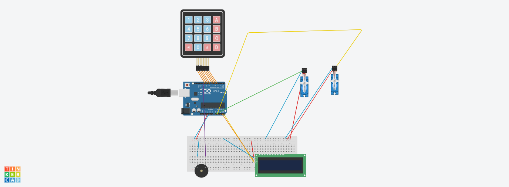
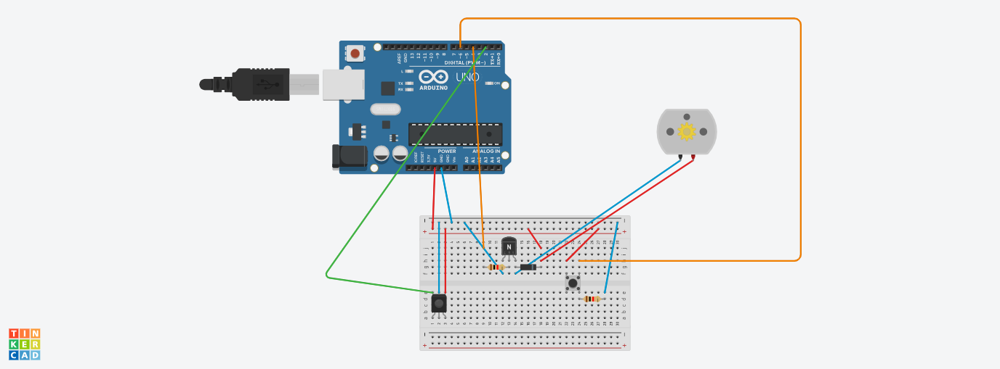
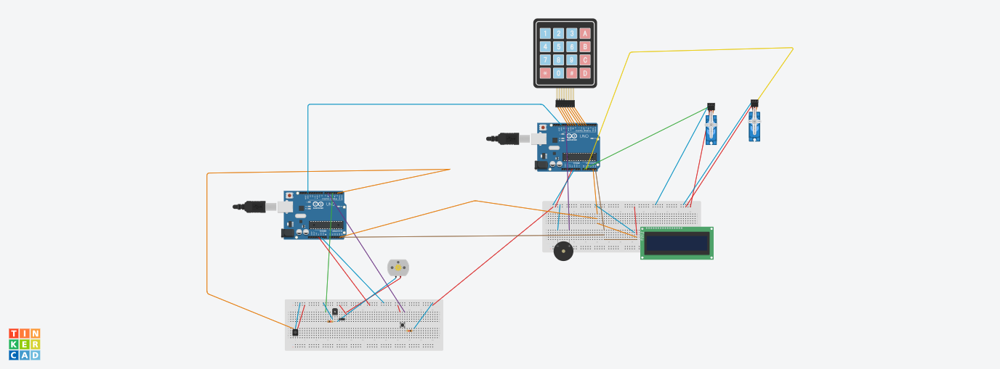
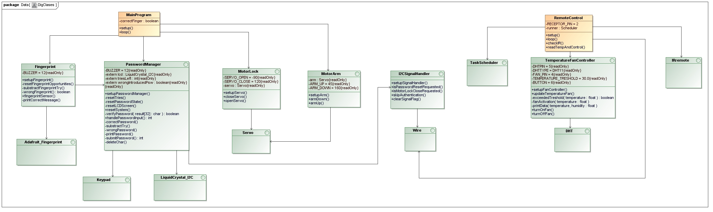

# Grupo 1: Sistema de Seguridad con Transmisión en Vivo y Personalización mediante IR

>[!NOTE]
> En caso de no tener ningún editor de texto que reconozca el formato `markdown (.md)` le recomendamos que acceda al [repositorio de github](https://github.com/AlfonsoRodr/Empotrados), en donde podrá visualizarlo sin ningún tipo de problemas, además de poder ver el proyecto al completo.

## Tabla de Contenidos
- [Participantes](#-participantes)
- [Librerías Necesarias](#-librerías-necesarias)
- [Introducción](#-introducción)
- [Funcionamiento](#-funcionamiento)
- [Material Usado y Costes](#-material-usado-y-costes)
- [Diseño](#-diseño)
- [Estructura del Proyecto](#-estructura-del-proyecto)
- [Implementación](#-implementación)
- [Construcción](#-construcción)
- [Demostración](#-demostración)

## 👥 Participantes
<table>
  <thead>
    <th>Nombre</th>
    <th>Cuenta de la Universidad</th>
  </thead>
  <tbody>
    <tr>
      <td>Alfonso Rodríguez Gutt</td>
      <td>a.rodriguezgu.2022@alumnos.urjc.es</td>
    </tr>
    <tr>
      <td>Raúl Sánchez Benítez</td>
      <td>TBD</td>
    </tr>
    <tr>
      <td>Héctor González Viñas</td>
      <td>TBD</td>
    </tr>
    <tr>
      <td>Andrés Muñoz Muñoz</td>
      <td>TBD</td>
    </tr>
  </tbody>
</table>

## 📚 Librerías Necesarias
Para el desarrollo de este proyecto, se hicieron uso de algunas librerías externas que es probable que no estén instaladas por defecto en su IDE de Arduino, a continuación se mencionarán dichas librerías:
- Keypad.h
- LiquidCrystal_I2C.h
- IRremote.h
- TaskScheduler.h
- DHT.h
- Adafruit_Fingerprint.h
- Servo.h
- Wire.h

## 🚀 Introducción
**BREVE INTRODUCCIÓN DEL PROYECTO**

## 🧠 Funcionamiento
El comportamiento de este sistema es bastante similar al de un sistema de seguridad común que se puede encontrar en el día a día. Para este proyecto, se decidió dividir el sistema en 2 bloques independientes, en uno se iba a encontrar toda la lógica y gestión de la caja fuerte, y en la otra, todo lo relacionado con la cámara y su pequeño sistema de refrigeración.

### 🔒 Bloque 1
Se dispone de una matriz de botones 4x4 en el que el usuario tendrá 3 intentos para introducir la contraseña correcta; en caso de agotar todos los intentos, el sistema se bloqueará, y solo el dueño de la caja fuerte podrá habilitar nuevamente el sistema. En caso contrario, el usuario deberá de validar su huella dactilar haciendo uso del lector de huellas, como último factor de autenticación antes de poder acceder a la caja fuerte; en donde tendrá un total de 5 intentos para colocar la huella correcta, en caso de agotar los intentos, el sistema se bloqueará. Una vez la huella sea reconocida, la caja fuerte se abrirá desplegando consigo un brazo mecánico que tendrá consigo el objeto que se guardó.

### 📷❄️ Bloque 2
Para añadir una mejor seguridad y proporcionar mayor información sobre lo que está sucediendo cuando un usuario intenta interactuar con el sistema, se utilizó una cámara de seguridad cuyo funcionamiento es independiente del bloque anterior. Esta cámara transmitirá en vivo y en directo todo lo que suceda mientras un usuario se encuentre interactuando con el sistema. Sin embargo, esta cámara tiene un ligero defecto y es el aumento de temperatura que puede sufrir mientras esté operativa, es por ello, que se decidió controlar dicha temperatura haciendo uso de un sensor de temperatura, que, tras superar una temperatura umbral, activaría un ventilador para enfriar un poco dicha cámara.

### 📡 Gestión de IR y Comunicación mediante Protocolo I2C
Como se explicó previamente, una vez que se agotan todos los intentos disponibles (ya sea para ingresar la contraseña o verificar la huella dactilar), el sistema entra en un estado de bloqueo permanente. Sin embargo, existe un mecanismo especial para que el propietario pueda desbloquearlo: el uso de un control remoto infrarrojo (IR). Al presionar un botón específico en el control, se envía una señal que es captada por un receptor IR, lo cual permite al sistema salir del estado de bloqueo.

>[!NOTE]
> Pese a que la idea original fue enfocada para desbloquear el sistema, se añadieron funcionalidades adicionales que se explicarán a lo largo de esta sección.

Cabe destacar que la comunicación entre los componentes encargados de este proceso se realiza mediante el `protocolo I2C` entre dos microcontroladores Arduino. Este esquema de comunicación sigue el esquema de `maestro - esclavo`, siendo el maestro el Arduino emisor, y el esclavo el Arduino receptor. El `maestro` es el que recibe las señales IR provenientes del control remoto, y asocia cada señal a un caracter en concreto que enviará al `esclavo` haciendo uso de la librería `Wire.h`. Por otra parte, el `esclavo` espera a recibir alguno de esos caracteres enviados, y en función del caracter recibido, realizará una acción concreta como puede ser, desbloquear el sistema.

> [!NOTE]
> La explicación sobre la forma en la que se establecieron las conexiones a nivel de hardware para poder conseguir esta comunicación, se realizará en la sección de [Diseño](#-diseño)

>[!IMPORTANT]
> Se considera que el mando IR únicamente lo tiene el dueño o alguien de confianza del dueño, en caso de pérdida o de que caiga en manos equivocadas, no nos hacemos responsables ya que cae de la responsabilidad del dueño quién tiene acceso a dicho control remoto.

>[!WARNING]
> Dado que la comunicación entre los dos Arduinos se establece mediante el protocolo I2C, es posible que en ciertos momentos se observen variaciones en la luminosidad de la pantalla LCD o pequeños fallos en su funcionamiento. Esto puede deberse a interrupciones ocasionales en la comunicación, que afectan temporalmente al comportamiento de la pantalla.
Es importante destacar que estos efectos `no implican un mal funcionamiento del sistema en general`; simplemente, la pantalla puede presentar un comportamiento inesperado sin que ello interfiera en el correcto desempeño del resto del sistema.

A continuación, se presenta una tabla mostrando de una forma mñás visual lo mencionado previamente:
<table>
  <thead>
    <th>Botón Pulsado</th>
    <th>Señal Correspondiente (Dec)</th>
    <th>Caracter que se Envía</th>
    <th>Acción que realiza el Arduino Esclavo</th>
  </thead>
  <tbody>
    <tr>
      <td>0</td>
      <td>22</td>
      <td>'F'</td>
      <td>Resetea el sistema, volviendo al estado inicial.</td>
    </tr>
    <tr>
      <td>1</td>
      <td>12</td>
      <td>"C"</td>
      <td>Cierra el pestillo de la caja fuerte, que es controlado por el Servo Motor.</td>
    </tr>
    <tr>
      <td>2</td>
      <td>24</td>
      <td>"S"</td>
      <td>Omite la autenticación del usuario</td>
    </tr>
    <tr>
      <td>+</td>
      <td>21</td>
      <td>NA</td>
      <td>Encender Ventilador</td>
    </tr>
  </tbody>
</table>

>[!IMPORTANT]
> Inicialmente, el apagado del ventilador también iba a ser controlado mediante IR. Sin embargo, una vez que el motor DC que alimenta el ventilador se encuentra encendido, el receptor IR deja de recibir correctamente las señales enviadas por el control remoto. Esto se debe al `ruido eléctrico`, también conocido como `interferencia electromagnética (EMI)` generado por el motor, el cual impide que las señales IR sean leídas de forma adecuada. Como resultado, se optó por controlar el apagado del ventilador mediante un `botón`.

A continuación, se muestra un diagrama de actividad que refleja el funcionamiento del sistema de una forma más visual, para así complementar con lo dicho previamente.


>[!NOTE]
> La transmisión en vivo ofrecida por la cámara, se puede ver introduciendo en cualquier navegador web, la IP que dicha cámara devuelve una vez esté correctamente operativa.

> [!WARNING]
> Es importante que usted tenga en cuenta que el ventilador que se usó para refrigerar la cámara, no es el más sofisticado ni potente que existe, es debido a ello que usted pueda apreciar que la temperatura de la cámara tarda un poco más de lo que debería en bajar.
> Además, también es importante que usted tenga en cuenta que debido a que la cámara no es la más sofisticada que hay, es posible que la transmisión se aprecie a una calidad inferior a la deseada o que la imagen se pueda congelar. Esto como ya digo, sucede por la calidad de la cámara.

## 📋 Material Usado y Costes
<table>
  <thead>
    <th>Componente</th>
    <th>Cantidad</th>
    <th>Precio (€)</th>
  </thead>
  <tbody>
    <tr>
      <td>Sensor de movimiento PIR</td>
      <td>1</td>
      <td>6.80</td>
    </tr>
    <tr>
      <td>Módulo de cámara ESP32-CAM</td>
      <td>1</td>
      <td>21.05</td>
    </tr>
    <tr>
      <td>Detector de huella dactilar</td>
      <td>1</td>
      <td>18.99</td>
    </tr>
    <tr>
      <td>Adaptador FTDI</td>
      <td>1</td>
      <td>12.98</td>
    </tr>
    <tr>
      <td>Pantalla LCD</td>
      <td>1</td>
      <td>0</td>
    </tr>
    <tr>
      <td>Interfaz I2C</td>
      <td>1</td>
      <td>0</td>
    </tr>
    <tr>
      <td>Matriz de botones 4x4</td>
      <td>1</td>
      <td>0</td>
    </tr>
    <tr>
      <td>Resistencias 1K</td>
      <td>2</td>
      <td>0</td>
    </tr>
    <tr>
      <td>Transistor NPN</td>
      <td>1</td>
      <td>0</td>
    </tr>
    <tr>
      <td>Buzzer pasivo</td>
      <td>1</td>
      <td>0</td>
    </tr>
    <tr>
      <td>Sensor de temperatura y humedad DHT11</td>
      <td>1</td>
      <td>0</td>
    </tr>
    <tr>
      <td>Diodo rectificador</td>
      <td>1</td>
      <td>0</td>
    </tr>
    <tr>
      <td>Ventilador</td>
      <td>1</td>
      <td>0</td>
    </tr>
    <tr>
      <td>Set IR</td>
      <td>1</td>
      <td>0</td>
    </tr>
    <tr>
      <td>Botón</td>
      <td>1</td>
      <td>0</td>
    </tr>
      <tr>
      <td><strong>TOTAL</strong></td>
      <td><strong>16</strong></td>
      <td><strong>59.82</strong></td>
    </tr>
  </tbody>
</table>

## 🧩 Diseño
En esta sección, se mostrarán las conexiones realizadas para llevar a cabo este proyecto.

>[!NOTE]
> Debido a que en Tinkercard no existen ciertos módulos, se mostrarán las conexiones respectivas a dichos módulos en una tabla.

### Bloque 1


>[!NOTE]
> También se proporciona el diagrama eléctrico de este bloque, si desea consultarlo, haga click en este [enlace](Proyecto/Diagrams/Electric/Bloque1Elec.pdf)

### Sensor de Huella Dactilar
<table>
  <thead>
    <th>Origen</th>
    <th>Destino</th>
  </thead>
  <tbody>
    <tr>
      <td>5V</td>
      <td>5V</td>
    </tr>
    <tr>
      <td>TX</td>
      <td>Pin Digital 2</td>
    </tr>
    <tr>
      <td>RX</td>
      <td>Pin Digital 3</td>
    </tr>
    <tr>
      <td>GND</td>
      <td>GND</td>
    </tr>
  </tbody>
</table>

### Bloque 2


>[!NOTE]
> También se proporciona el diagrama eléctrico de este bloque, si desea consultarlo, haga click en este [enlace](Proyecto/Diagrams/Electric/Bloque2.pdf)

### Sensor de Temperatura y Humedad DHT11
<table>
  <thead>
    <th>Origen</th>
    <th>Destino</th>
  </thead>
  <tbody>
    <tr>
      <th>5V</th>
      <th>5V</th>
    </tr>
    <tr>
      <th>GND</th>
      <th>GND</th>
    </tr>
    <tr>
      <th>DATA</th>
      <th>Pin Digital 5</th>
    </tr>
  </tbody>
</table>

### Módulo ESP32-CAM
Este módulo simplemente va conectado vía USB a la computadora.

### Protocolo I2C
Para establecer la comunicación a nivel de hardware mediante el protocolo I2C, se emplearon las líneas de datos serie (SDA) y de reloj (SCL). En el caso del Arduino UNO, estos pines están asignados por defecto a las entradas analógicas A4 (SDA) y A5 (SCL). Por lo tanto, para lograr establecer dicha comunicación, se conectaron los pines A4 y A5 de ambas placas entre sí.

Dado que también es necesario establecer la conexión con el módulo I2C, se estableció un punto eléctrico común para las líneas SDA y SCL, desde el cual se realizaron bifurcaciones hacia el maestro, el esclavo y el módulo I2C.


Finalmente, las conexiones del sistema en su totalidad tiene el siguiente aspecto:


>[!NOTE]
> También se proporciona el diagrama eléctrico del sistema, si desea consultarlo, haga click en este [enlace](Proyecto/Diagrams/Electric/Sistema.pdf)

## 📚 Estructura del Proyecto
A continuación, se describirá la estructura del proyecto, especificando la organización modular del código, la responsabilidad funcional de cada archivo fuente y la forma en que los distintos componentes interactúan entre sí dentro del sistema.

>[!NOTE]
> Tenga en cuenta que a pesar de que solo se haga mención al nombre del archivo como tal, cada uno de los archivos tiene su correspondiente interfaz (.h) y su implementación (.cpp)

<table>
  <thead>
    <th>Nombre del Archivo</th>
    <th>Responsabilidad</th>
    <th>Archivos con los que se relaciona</th>
  </thead>
  <tbody>
    <tr>
      <td>MainProgram.ino</td>
      <td>Es el archivo principal del proyecto. Es donde se realiza la ejecución del software</td>
      <td>PasswordManager, Fingerprint, MotorLock, MotorArm</td>
    </tr>
    <tr>
      <td>PasswordManager</td>
      <td>Gestiona la interacción con la matriz de botones, verificando si la contraseña introducida es correcta</td>
      <td>I2CSignalHandler</td>
    </tr>
    <tr>
      <td>Fingerprint</td>
      <td>Gestiona el segundo y último factor de autenticación del sistema, mediante el sensor de huella dactilar</td>
      <td>PasswordManager</td>
    </tr>
    <tr>
      <td>MotorLock</td>
      <td>Se encarga de gestionar el motor que opera el pestillo de la caja fuerte</td>
      <td>NA</td>
    </tr>
    <tr>
      <td>MotorArm</td>
      <td>Se encarga de gestionar el motor que opera el brazo que se encuentra dentro de la caja fuerte</td>
      <td>NA</td>
    </tr>
    <tr>
      <td>RemoteControl.ino</td>
      <td>Archivo .ino del segundo Arduino (emisor). Se encarga de recibir las señales IR para luego enviarlas mediante comunicación serial al Arduino receptor. También, se encarga de controlar el ventilador que tiene el sistema si la temperatura de la cámara supera cierto umbral</td>
      <td>TemperatureFanController</td>
    </tr>
    <tr>
      <td>TemperatureFanController</td>
      <td>Es el sistema de refrigeración de la cámara. Se encarga de medir la temperatura del módulo ESP32-CAM, y al superar cierto umbral, activa el ventilador</td>
      <td>NA</td>
    </tr>
    <tr>
      <td>I2CSignalHandler</td>
      <td>Es el manejador de la comunicación mediante el protocolo I2C siguiendo el esquema maestro-esclavo</td>
      <td>NA</td>
    </tr>
    <tr>
      <td>CameraWebServer</td>
      <td>Sketch obtenido de los ejemplos de Arduino para el ESP32-CAM. Permite la transmisión en vivo via web a través de la IP devuelta por dicho módulo.</td>
      <td>NA</td>
    </tr>
  </tbody>
</table>

A continuación, se muestra un `diagrama de clases` para reflejar de una forma más visual lo mencionado con anterioridad.



>[!NOTE]
> En el diagrama de clases mostrado anteriormente no se refleja el módulo de la cámara, esto se debe a que es un ejemplo que viene por defecto en el propio IDE de Arduino, que contiene sus propias librerías y archivos.

## 🧑‍💻 Implementación
En esta sección se mostrará la implementación de cada uno de los archivos mencionados en la sección anterior.

### MainProgram (.ino del Arduino Esclavo)
````cpp
#include "PasswordManager.h"
#include "FingerprintEsp.h"
#include <LiquidCrystal_I2C.h>
#include "MotorLock.h"
#include "MotorArm.h"

bool correctFinger = false;

void setup() {
  setupPasswordManager();
  setupFingerprint();
  setupServo();
  setupArm();
}

void loop() {
  lcd.setCursor(0, 0);
  lcd.print("Password:");
  if (handlePasswordInput() == 1) {
    if (skipAuthentication()) { // If the correct IR signal is received, the authentiation process is skipped.
      lcd.setCursor(0,0);
      lcd.print("Authentication");
      lcd.setCursor(0, 1);
      lcd.print("Skipped");
      delay(2000);
      clearSignalFlag();
      correctFinger = true;
    }
    else {
      lcd.clear();
      lcd.setCursor(0,0);
      lcd.print("Put your Finger");
      delay(2000);
      lcd.clear();
      for (int i = 0; i < 5; i++) {
        if (fingerprintSensor() == 1) {
          correctFinger = true;
          break;
        }
        else {
          lcd.clear();
          lcd.setCursor(0,0);
          lcd.print("Put your Finger");
        }
      }
    }
    lcd.clear();
    if (correctFinger) {
      openServo();
      delay(5000);
      armUp();

    }
  }
  if (isMotorLockCloseRequested()) { // If the correct IR signal is received, the motor lock and motor arm return to the original state.
    clearSignalFlag();
    closeServo();
    armDown();
  }
}
````

### PasswordManager
````cpp
/**
 * @file PasswordManager.cpp
 * @brief Implementation of the password management system for Arduino using keypad input.
 *
 * This file implements the core logic of a password-based access control system,
 * including keypad handling, password verification, visual and audio feedback, and
 * a limit on incorrect attempts. It uses a 4x4 keypad, an LCD for user interaction, and both a buzzer for signaling feedback.
 * 
 * @authors
 * - Alfonso Rodríguez
 * - Raúl Sánchez
 * - Héctor González
 * - Andrés Muñoz
 * 
 * @date 2025-04-03
 */
#include "PasswordManager.h"

// --- Keypad Configuration ---
const byte ROWS = 4;
const byte COLS = 4;
char keys[ROWS][COLS] = { 
  {'H', 'O', 'L', 'A'},
  {'1', '2', 'T', 'E'},
  {'O', '1', '9', 'C'},
  {'*', '0', 'D', 'S'}  // 'S' is used to submit the password and 'D' to delete a character
};

byte rowsPins[ROWS] = {11, 10, 9, 8};
byte colsPins[COLS] = {7, 6, 5, 4};

// --- Global Objects and Variables ---
Keypad teclado = Keypad(makeKeymap(keys), rowsPins, colsPins, ROWS, COLS);
LiquidCrystal_I2C lcd(0x3f, 16, 2);
int triesLeft = 3;
bool wrongIntroducedPsw = true;

const char password[7] = "HOLA12";  ///< Predefined 6-character password
int counter = 0;                   ///< Tracks number of typed characters
char result[32];                   ///< Buffer to store entered password

/**
 * @brief Initializes the password system hardware and state.
 *
 * Sets up the LCD display, buzzer, serial communication and the I2C Communication Handler.
 * Also initializes the password buffer for user input.
 *
 * @see I2CCommunication module.
 */
void setupPasswordManager() {
    Serial.begin(9600);
    setupSignalHandler(); // Initialize the I2C Handler.
    lcd.init();
    lcd.backlight();
    lcd.clear();
    pinMode(BUZZER, OUTPUT);
    Serial.println("Sistema de contraseña listo.");
    memset(result, 0, sizeof(result));
}

/**
 * @brief Resets the number of allowed password attempts.
 *
 * This function restores the triesLeft counter to its default value (3),
 * allowing the user to retry password entry after a reset or success.
 */
void resetTries() {
    triesLeft = 3;
}

/**
 * @brief Clears the password input state.
 *
 * Resets the entered characters, clears the input buffer, and stops any buzzer tone.
 */
void resetPasswordState() {
    memset(result, 0, sizeof(result));
    counter = 0;
    noTone(BUZZER);
}

/**
 * @brief Clears and reinitializes the LCD display.
 *
 * Displays the default password input prompt on the first row of the LCD.
 */
void resetLCDScreen() {
    lcd.clear();
    lcd.setCursor(0, 0);
    lcd.print("Password: ");
}

/**
 * @brief Performs a complete reset of the password system.
 *
 * Resets attempt counter, password buffer, and LCD screen to their initial state.
 */
void resetSystem() {
    resetTries();
    resetPasswordState();
    resetLCDScreen();
    handlePasswordInput();
}

/**
 * @author Alfonso Rodríguez.
 * @brief Verifies if the entered password matches the stored one.
 *
 * Compares the user-provided password with the predefined value.
 * Only passwords of exactly 6 characters are considered valid for comparison.
 *
 * @param result Character array containing the user input.
 * @return true if the password is correct, false otherwise.
 */
bool verifyPassword(char result[32]) {
    if (strlen(result) != 6) {
        return false;
    }
    return strcmp(result, password) == 0;
}

/**
 * @author Alfonso Rodríguez.
 * @brief Displays a masked password (with asterisks) on the LCD.
 *
 * Each character typed by the user is represented by an asterisk (`*`)
 * on the second line of the LCD screen to preserve confidentiality.
 */
void printPassword() {
    lcd.setCursor(0, 1);
    for (int i = 0; i <= counter; i++) {
        lcd.print('*');
    }
}

/**
 * @author Alfonso Rodríguez.
 * @brief Handles password submission and validation.
 * 
 * This function finalizes the input by null-terminating the password buffer,
 * clears the LCD display, and prints the result to the serial monitor.
 * It then verifies whether the input matches the predefined password.
 * 
 * On success, it resets the attempt counter and displays positive feedback.
 * On failure, it calls the error handler and decrements the number of attempts.
 * 
 * @return `1` if the password is correct,
 *         `0` if the password is incorrect.
 */
int submitPassword() {
    result[counter] = '\0';
    counter = 0;
    Serial.println(result);
    lcd.clear();
    if (verifyPassword(result)) {
        correctPassword();
        triesLeft = 3;
        return 1;
    } 
    else {
        wrongPassword();
        return 0;
    }
}

/**
 * @author Andrés Muñoz.
 * @brief Deletes the last entered character from the password buffer.
 * 
 * This function removes the most recent character from the input buffer
 * and updates the LCD display by erasing the corresponding asterisk (`*`)
 * on the second row. It also repositions the cursor for consistent input feedback.
 */
void deleteChar() {
    if (counter > 0) {
        counter--;
        result[counter] = '\0';
        lcd.setCursor(counter, 1);
        lcd.print(' ');
        lcd.setCursor(counter, 1);
    }
}

/**
 * @author Alfonso Rodríguez.
 * @brief Handles keypad input and password submission.
 *
 * This function captures user input from the keypad, updates the password buffer,
 * and displays masked characters. Upon pressing the 'S' key, the entered password 
 * is verified and appropriate actions are taken for success or failure.
 *
 * @return An integer indicating the result:
 * - `1` → Correct password
 * - `0` → Incorrect password
 * - `-1` → No submission yet (still typing)
 */
int handlePasswordInput() {
    char key = teclado.getKey();

    if (((key != 'S') && (key != NO_KEY)) && (key != 'D')) {
        if (counter < 31) {
            printPassword();
            Serial.print("Tecla presionada: ");
            Serial.println(key);
            result[counter] = key;
            counter++;
        } 
        else {
            lcd.clear();
            lcd.setCursor(0, 0);
            lcd.print("Password too long");
            delay(2000);
            return 0;
        }
    } 
    else if (key == 'S') {
        return submitPassword();
    }
    else if (key == 'D') {
        deleteChar();
    }
    return -1;
}

/**
 * @author Raúl Sánchez.
 * @brief Executes success feedback upon correct password entry.
 *
 * This function shows a confirmation message, and emits a short buzzer tone to indicate success.
 */
void correctPassword() {
    lcd.clear();
    lcd.setCursor(0, 0);
    lcd.print("Correct password!!");
    tone(BUZZER, 100);
    delay(300);
    noTone(BUZZER);
    delay(1000);
    lcd.clear();
}

/**
 * @author Héctor González.
 * @brief Reduces the remaining attempts and provides feedback.
 *
 * Decreases triesLeft by one, displays an error message, and activates
 * a buzzer tone to signal an incorrect password attempt.
 */
void substractTry() {
    triesLeft--;
    lcd.setCursor(0, 0);
    lcd.print("Wrong password");
    lcd.setCursor(0, 1);
    lcd.print("Tries left: ");
    lcd.print(triesLeft);
    delay(1000);
    tone(BUZZER, 500);
    delay(500);
    noTone(BUZZER);
    lcd.clear();
}

/**
 * @author Héctor González.
 * @author Alfonso Rodríguez.
 * @brief Executes error feedback upon incorrect password entry.
 *
 * Decrements the number of allowed attempts and provides feedback through
 * the LCD and a buzzer tone. If no attempts remain, triggers a blocking alert loop.
 *
 * @note It will unlock the system manually if the correct IR signal is received.
 */
void wrongPassword() {
    if (triesLeft > 0) {
        substractTry();
    }
    if (triesLeft == 0) {
        lcd.setCursor(0, 0);
        lcd.print("No tries left");
        unsigned long timeout = millis() + 10000; // The system is lock for 10 segs.
        while (millis() < timeout) {
            tone(BUZZER, 1000);
            delay(300);
            tone(BUZZER, 1500);
            delay(300);
            if (isPasswordResetRequested()) {
                clearSignalFlag(); // Reset the Signal.
                break;
            }
        }
        resetSystem();
    }
}
````

### Fingerprint
````cpp
/**
 * @file FingerprintImpl.cpp
 * @brief Implementation of fingerprint sensor operations using Adafruit Fingerprint library.
 *
 * This file contains the logic to initialize the fingerprint sensor, 
 * read and verify fingerprints, and provide feedback to the user through LCD display. 
 * It includes user interaction messages for successful and failed authentication attempts.
 * 
 * @see PasswordManager
 *
 * @author Alfonso Rodríguez
 * @date 2025-03-26
 */

#include "FingerprintEsp.h"
#include "PasswordManager.h"
#include <Arduino.h>

#if (defined(__AVR__) || defined(ESP8266)) && !defined(__AVR_ATmega2560__)
SoftwareSerial mySerial(2, 3);
#endif

Adafruit_Fingerprint finger = Adafruit_Fingerprint(&mySerial);

int opportunities = 5;

/**
 * @brief Initializes the fingerprint sensor and configures necessary hardware.
 *
 * This function sets up serial communication, configures the output pins
 * for the red and green LEDs, initializes the fingerprint sensor module and initialize the I2C communication handler.
 * It verifies whether the sensor is properly connected and operational.
 *
 * @details
 * - Begins serial communication at 9600 baud.
 * - Initializes the fingerprint sensor at 57600 baud.
 * - If the fingerprint sensor is detected and verified, it proceeds.
 * - If not detected, it prints an error message and halts execution.
 *
 * @note This function blocks indefinitely if the fingerprint sensor is not found.
 * @warning Ensure the fingerprint sensor is properly connected before powering the device.
 *
 * @see I2CCommunication Module.
 */
void setupFingerprint() {
    Serial.begin(9600);
    setupSignalHandler();
    while (!Serial);  
    delay(100);

    Serial.println("Inicializando sensor de huellas...");

    finger.begin(57600);
    delay(5);
    
    if (finger.verifyPassword()) {
        Serial.println("Fingerprint sensor online.");
    } 
    else {
        Serial.println("Error: Fingerprint sensor offline");
        while (1) { 
            delay(1000); 
        }
    }
}

/**
 * @brief Resets the number of remaining fingerprint attempts to the maximum allowed.
 * 
 * This function sets the internal `opportunities` counter back to 5,
 * which is the maximum number of fingerprint verification attempts allowed.
 * It is typically called after a successful authentication or when the system resets,
 * ensuring the user starts fresh with a full set of tries.
 */
void resetFingerOpportunities() {
    opportunities = 5;
}

/**
 * @brief Displays a success message when a fingerprint is correctly recognized.
 *
 * This function clears the LCD and shows a message indicating that a fingerprint
 * has been successfully detected. After a short delay, it welcomes the user
 * and displays their fingerprint ID.
 *
 * @note Uses `finger.fingerID` to print the ID of the recognized user.
 * @warning This function includes delays (`delay(2000)`), which may block execution for 2 seconds.
 */
void printCorrectMessage() {
    lcd.clear();
    lcd.setCursor(0, 0);
    lcd.print("Fingerprint");
    lcd.setCursor(0, 1);
    lcd.print("Detected!!");
    delay(2000);
    lcd.clear();
    lcd.setCursor(0, 0);
    lcd.print("Welcome Back");
    lcd.setCursor(0, 1);
    lcd.print("User: ");
    lcd.print(finger.fingerID);
}

/**
 * @brief Reduces the remaining attempts and provides feedback.
 *
 * Decreases `opportunities` by one, displays an error message, and activates
 * a buzzer tone to signal an incorrect fingerprint attempt.
 */
void substracFingerprintTry() {
    opportunities--;
    lcd.setCursor(0, 0);
    lcd.print("Not Detected");
    lcd.setCursor(0, 1);
    lcd.print("Tries left: ");
    lcd.print(opportunities);
    delay(1000);
    tone(BUZZER, 500);
    delay(500);
    noTone(BUZZER);
    lcd.clear();
}

/**
 * @brief Executes error feedback upon incorrect fingerprint reading.
 *
 * Decrements the number of allowed attempts and provides feedback through
 * the LCD and a buzzer tone. If no attempts remain, triggers a blocking alert loop.
 *
 * @note It will unlock the system manually if the correct IR signal is received.
 */
void wrongFingerPrint() {
    if (opportunities > 0) {
        substracFingerprintTry();
    }
    if (opportunities == 0) {
        lcd.setCursor(0, 0);
        lcd.print("No tries left");
        unsigned long timeout = millis() + 10000; // The system is lock for 10 segs.
        while (millis() < timeout) {
            tone(BUZZER, 1000);
            delay(300);
            tone(BUZZER, 1500);
            delay(300);
            if (isPasswordResetRequested()) {
                clearSignalFlag();  // Reset the Signal.
                break;
            }
        }
        resetFingerOpportunities();
        resetSystem();
    }
}

/**
 * @brief Handles fingerprint recognition using the fingerprint sensor module.
 *
 * This function reads and processes a fingerprint image, then searches for a match
 * in the stored database. If a fingerprint is successfully recognized, it displays
 * a welcome message on the LCD, turns on a green LED, and prints the user ID and
 * confidence level to the serial monitor. If the fingerprint is not recognized,
 * it shows an error message and turns on a red LED briefly.
 *
 * @details
 * - If the image cannot be read or processed, an appropriate error message is printed.
 * - If the fingerprint is matched, it calls printCorrectMessage().
 * - If not matched, it calls printWrongMessage().
 */
int fingerprintSensor() {
    uint8_t p = finger.getImage();
    if (p != FINGERPRINT_OK) {
        Serial.println("No se pudo leer la huella. Intenta de nuevo.");
        return -1;
    } 
    else {
        p = finger.image2Tz();
        if (p != FINGERPRINT_OK) {
            Serial.println("No se pudo procesar la huella.");
            delay(1000);
            return;
        }

        p = finger.fingerSearch();
        if (p == FINGERPRINT_OK) {
            resetFingerOpportunities();
            printCorrectMessage();
            Serial.print("Huella reconocida. ID: "); 
            Serial.println(finger.fingerID);
            Serial.print("Nivel de confianza: "); 
            Serial.println(finger.confidence);
            delay(5000);
            lcd.clear();
            return 1;
        } 
        else {
            Serial.println("Huella no reconocida.");
            delay(5000);
            wrongFingerPrint();
            return 0;
        }
    }
    delay(1000);
}
````

### MotorLock
````cpp
/**
 * @file MotorLock.cpp
 * @author Raúl Sánchez.
 * @brief Implementation file for servo motor lock control functions.
 *
 * This file provides the implementation of functions declared in MotorLock.h,
 * allowing control of a servo motor that operates as a locking mechanism.
 */
#include "MotorLock.h"

Servo servo;

/**
 * @brief Initializes the servo motor.
 *
 * Attaches the servo to the specified pin and sets it to the locked position and initialize the I2C communication handler.
 */
void setupServo(){
  servo.attach(14);
  servo.write(SERVO_CLOSE);
}

/**
 * @brief Locks the mechanism by moving the servo to the closed position.
 */
void closeServo(){
  servo.write(SERVO_CLOSE);
}

/**
 * @brief Unlocks the mechanism by moving the servo to the open position.
 */
void openServo(){
  servo.write(SERVO_OPEN);
}
````

### MotorArm
````cpp
/**
 * @file MotorArm.cpp
 * @author Raúl Sánchez.
 * @brief Implementation file for servo motor arm control functions.
 *
 * This file provides the implementation of functions declared in MotorArm.h,
 * allowing control of a servo motor that operates as a mechanic arm.
 */
#include "MotorArm.h"
#include <Arduino.h>

Servo arm;

/**
 * @brief Initializes the servo motor.
 *
 * Attaches the servo to the specified pin and sets it to the down position and initialize the I2C communication handler.
 */
void setupArm(){
  arm.attach(15);
  arm.write(ARM_DOWN);
}

/**
 * @brief Moves the servo mechanism to the down position.
 */
void armDown(){
    for (int pos = ARM_UP; pos <= ARM_DOWN; pos++) {
        arm.write(pos);
        delay(10);
    }
}

/**
 * @brief Moves the servo mechanism to the up position.
 */
void armUp(){
    for (int pos = ARM_DOWN; pos >= ARM_UP; pos--) {
        arm.write(pos);
        delay(10);
    }
}
````

### I2CSignalHandler
````cpp
/**
 * @file I2CSignalHandler.cpp
 * @brief Handles I2C communication signals and maps them to internal control flags.
 *
 * This module listens for specific I2C signals sent from a master device
 * and sets flags based on the received command. These flags can then be
 * queried from other parts of the program to perform corresponding actions.
 *
 * Signal Mapping:
 * - 'F' : Unlocks the system.
 * - 'C' : Lock the motor mechanism.
 * - 'S' : Bypass the authentication process.
 *
 * @author Alfonso Rodríguez.
 * @date 2025-04-23
 */

#include "I2CSignalHandler.h"

volatile SignalType lastSignal = NONE; ///< Stores the last received signal

/**
 * @brief Callback function triggered when data is received over I2C.
 *
 * This function reads incoming characters from the I2C buffer and
 * updates the internal signal flag accordingly.
 */
void receiveI2CSignal() {
  while (Wire.available()) {
    char receivedChar = Wire.read();
    if (receivedChar == 'F') {
      lastSignal = PASSWORD_RESET;
    } 
    else if (receivedChar == 'C') {
      lastSignal = MOTOR_LOCK_CLOSE;
    }
    else if (receivedChar == 'S') {
      lastSignal = SKIP;
    }
  }
}

/**
 * @brief Initializes I2C as a slave and registers the receive callback.
 */
void setupSignalHandler() {
  Wire.begin(8);  // Slave with direction 8.
  Wire.onReceive(receiveI2CSignal);
}

/**
 * @brief Checks if a password reset was requested via I2C.
 * @return true if a password reset signal was received
 */
bool isPasswordResetRequested() {
  return lastSignal == PASSWORD_RESET;
}

/**
 * @brief Checks if the motor lock should be closed based on I2C signal.
 * @return true if a motor lock close signal was received
 */
bool isMotorLockCloseRequested() {
  return lastSignal == MOTOR_LOCK_CLOSE;
}

/**
 * @brief Checks if authentication should be skipped.
 * @return true if a skip authentication signal was received
 */
bool skipAuthentication() {
  return lastSignal == SKIP;
}

/**
 * @brief Clears the current signal flag (sets it to NONE).
 */
void clearSignalFlag() {
  lastSignal = NONE;
}
````

### RemoteControl (.ino del Arduino Maestro)
````cpp
/**
 * @file RemoteControl.ino
 * @brief Main controller for IR signal handling, temperature monitoring, and I2C communication.
 *
 * This sketch uses IR remote signals to control different functionalities,
 * such as toggling a fan, unlocking a system via I2C, and bypassing authentication.
 * It also periodically reads temperature values and controls a fan accordingly.
 *
 * @author 
 * Alfonso Rodríguez.
 * @date 2025-04-23
 */

#include <TaskScheduler.h>
#include <IRremote.h>
#include <Wire.h>
#include "TemperatureFanController.h"

// === IR setup ===
const int RECEPTOR_IR_PIN = 2;
IRrecv irrecv(RECEPTOR_IR_PIN); // IR receiver object instance.

// === I2C setup ===
const byte RECEPTOR_I2C_ADDRESS = 8;

// === Scheduler & Tasks ===
Scheduler runner;

void checkIR();             // Forward declaration
void readTempAndControl();  // Forward declaration

Task taskIR(50, TASK_FOREVER, &checkIR);               // Check IR every 50ms
Task taskTemp(2000, TASK_FOREVER, &readTempAndControl); // Every 2 sec

void setup() {
  Serial.begin(9600);
  Wire.begin();  // Initialize the I2C as a Master.
  irrecv.enableIRIn();  // Initialize the IR receiver.
  setupTemperatureFan(); // Initialize DHT and fan
  runner.init(); // Initialize the tasker.
  runner.addTask(taskIR); // Add the IR to the tasks queue.
  runner.addTask(taskTemp); // Add the TemperatureFanController operations to the tasks queue.
  taskIR.enable();
  taskTemp.enable();
}

void loop() {
  runner.execute();  // Run scheduled tasks.
}

/**
 * @brief Checks for incoming IR signals and acts accordingly.
 * 
 * IR Remote Commands:
 * - Command 22: Sends 'F' via I2C to unlock system.
 * - Command 12: Sends 'C' via I2C to close motor lock.
 * - Command 24: Sends 'S' via I2C to skip authentication.
 * - Command 21: Turns the fan ON manually.
 */
void checkIR() {
  turnOffFan(); // If the button is pressed, the fan will turn off.
  if (irrecv.decode()) {
    unsigned long value = irrecv.decodedIRData.command;
    Serial.println(value);

    if (value == 22) { // Button: '0'
      Wire.beginTransmission(RECEPTOR_I2C_ADDRESS);
      Wire.write('F');  // Unlock the system.
      Wire.endTransmission();
    }
    else if (value == 12) { // Button: '1'
      Wire.beginTransmission(RECEPTOR_I2C_ADDRESS);
      Wire.write('C');  // Close the Motor.
      Wire.endTransmission();
    }
    else if (value == 24) { // Button: '2'
      Wire.beginTransmission(RECEPTOR_I2C_ADDRESS);
      Wire.write('S');  // Skip Authentication.
      Wire.endTransmission();
    }
    else if (value == 21) { // Button: '+'
      turnOnFan();  // Fan ON manually
    }
    irrecv.resume();  // Resume listening for the next IR signal.
  }
}

/**
 * @brief Reads temperature and controls the fan based on thresholds.
 * 
 * @see TemperatureFanController module.
 */
void readTempAndControl() {
  updateTemperatureFan();
}
````

### TemperatureFanController
````cpp
/**
 * @file TemperatureFanController.cpp
 * @author Alfonso Rodríguez.
 * @brief Implementation file for temperature and fan control using a DHT11 sensor.
 */

#include "TemperatureFanController.h"

// Create the DHT sensor object
DHT dht(DHTPIN, DHTTYPE);

bool manualOverride = false;
 
/**
 * @brief Initializes serial communication, the DHT sensor, and fan control pin.
 *
 * This function sets up the hardware required for temperature monitoring.
 * It begins the serial interface, initializes the DHT11 sensor, and configures
 * the fan control pin as an output, starting in the OFF state.
 */
void setupTemperatureFan() {
  Serial.begin(9600);
  dht.begin();
 
  pinMode(FAN_PIN, OUTPUT);
  digitalWrite(FAN_PIN, LOW); // Ensure fan is off at startup
}

/**
 * @brief Checks if the given temperature exceeds the predefined threshold.
 *
 * This function compares the provided temperature with the threshold value (TEMPERATURE_TRESHOLD).
 * If the temperature is higher than the threshold, it returns true; otherwise, it returns false.
 *
 * @param temperature The current temperature value.
 * @return A boolean value indicating whether the temperature exceeds the threshold.
 */
bool exceededTreshold(float temperature) {
  return temperature > TEMPERATURE_TRESHOLD;
}

/**
 * @brief Controls the activation of the fan based on the current temperature.
 * This function checks if the current temperature exceeds the predefined threshold.
 * If it does, the fan is turned on, and a message is printed to the serial monitor.
 * If the temperature is below the threshold, the fan is turned off, and a message is printed to the serial monitor.
 * The fan's state is controlled via the FAN_PIN, and the fan's status is communicated via the serial monitor.
 *
 * @param temperature is the temperature that has been read.
 */
void fanActivation(float temperature) {
  if (manualOverride) {
    return;
  }
  if (exceededTreshold(temperature)) {
    digitalWrite(FAN_PIN, HIGH);
    Serial.println("Fan ON (Auto)");
  } 
  else {
    digitalWrite(FAN_PIN, LOW);
    Serial.println("Fan OFF (Auto)");
  }
}

/**
 * @brief Manually turns on the fan and overrides automatic control.
 *
 * This function sets the fan to the ON state regardless of the current temperature.
 * It enables manual override, preventing automatic temperature-based control
 * from modifying the fan state until manual override is disabled.
 */
void turnOnFan() {
  manualOverride = true;
  digitalWrite(FAN_PIN, HIGH);
  Serial.println("Fan ON (Manual)");
}

/**
 * @brief Manually turns off the fan and overrides automatic control.
 *
 * This function sets the fan to the OFF state regardless of the current temperature.
 * It enables manual override, preventing automatic temperature-based control
 * from modifying the fan state until manual override is disabled.
 */
void turnOffFan() {
  if (digitalRead(BUTTON) == HIGH) {
    if (digitalRead(FAN_PIN) == HIGH) {
      manualOverride = false;
    }
    else {
      manualOverride = true;
    }
    Serial.println("Boton Presionado");
    digitalWrite(FAN_PIN, LOW);
    Serial.println("Fan OFF (Manual)");
  }
}

/**
 * @brief Prints the current temperature and humidity data to the serial monitor.
 * This function outputs the current temperature and humidity readings to the serial monitor,
 * formatted as "Temperature: <value> °C | Humidity: <value> %".
 * The information helps to monitor the environment and assess the performance of the system.
 *
 * @param temperature is the temperature that has been read.
 * @param humidity is the humidity that has been read.
 */
void printData(float temperature, float humidity) {
  Serial.print("Temperature: ");
  Serial.print(temperature);
  Serial.print(" °C  |  Humidity: ");
  Serial.print(humidity);
  Serial.println(" %");
}
 
/**
 * @brief Reads temperature and humidity from the DHT11 sensor and controls the fan.
 *
 * If the temperature exceeds 30°C, the fan is turned on; otherwise, it remains off.
 * Sensor data and fan status are printed to the serial monitor.
 * If the sensor fails to provide valid readings, an error message is shown instead.
 */
void updateTemperatureFan() {
  float humidity = dht.readHumidity();
  float temperature = dht.readTemperature();
 
  // Validate readings
  if (isnan(humidity) || isnan(temperature)) {
    Serial.println("Failed to read from DHT11 sensor!");
    return;
  }
  printData(temperature, humidity);
  fanActivation(temperature);
} 
````

## 🔧 Construcción
**AQUÍ SE MENCIONARÁN LAS FASES EN LA QUE SE ORGANIZÓ EL PROYECTO PARA CONSTRUIR LA PARTE FÍSICA**

## 🧪 Demostración
**AQUÍ VA A IR EL VIDEO DE DEMOSTRACIÓN**
